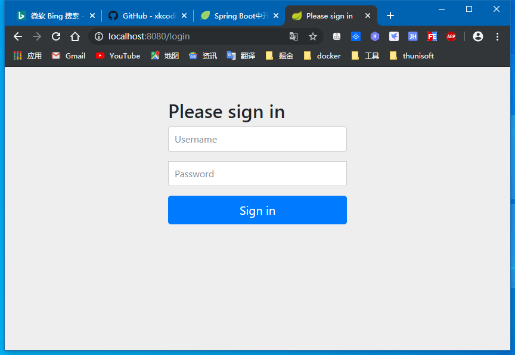
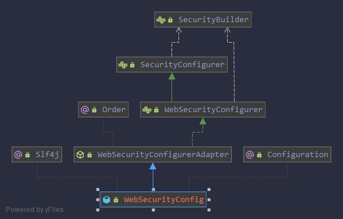

## Spring Boot中开启Spring Security

> Spring Security是一款基于Spring的安全框架，主要包含认证和授权两大安全模块，于另一款流行的安全框架Apache Shiro相比，Spring Security拥有更强大的功能。
>
> Spring Security可以轻松的自定义扩展满足各种需求，并且对常见的Web安全攻击提供防护支持。

### 开启Spring Security

> 创建一个Spring Boot项目，然后引入相关的配置`spring-boot-starter-security`:

```xml
<?xml version="1.0" encoding="UTF-8"?>
<project xmlns:xsi="http://www.w3.org/2001/XMLSchema-instance" xmlns="http://maven.apache.org/POM/4.0.0"
         xsi:schemaLocation="http://maven.apache.org/POM/4.0.0 https://maven.apache.org/xsd/maven-4.0.0.xsd">
    <modelVersion>4.0.0</modelVersion>

    <artifactId>security</artifactId>
    <version>0.0.1-SNAPSHOT</version>
    <name>start-spring-security</name>
    <description>Demo project for Spring Boot</description>

    <parent>
        <groupId>com.gusuchen</groupId>
        <artifactId>spring-boot-demo</artifactId>
        <version>1.0-SNAPSHOT</version>
    </parent>

    <properties>
        <project.build.sourceEncoding>UTF-8</project.build.sourceEncoding>
        <project.reporting.outputEncoding>UTF-8</project.reporting.outputEncoding>
        <java.version>1.8</java.version>
    </properties>

    <dependencies>
        <dependency>
            <groupId>org.springframework.boot</groupId>
            <artifactId>spring-boot-starter-security</artifactId>
        </dependency>
        <dependency>
            <groupId>org.springframework.boot</groupId>
            <artifactId>spring-boot-starter-web</artifactId>
        </dependency>

        <dependency>
            <groupId>org.projectlombok</groupId>
            <artifactId>lombok</artifactId>
        </dependency>

        <dependency>
            <groupId>org.springframework.boot</groupId>
            <artifactId>spring-boot-starter-test</artifactId>
            <scope>test</scope>
        </dependency>
        <dependency>
            <groupId>org.springframework.security</groupId>
            <artifactId>spring-security-test</artifactId>
            <scope>test</scope>
        </dependency>
    </dependencies>

    <build>
        <finalName>start-spring-security</finalName>
        <plugins>
            <plugin>
                <groupId>org.springframework.boot</groupId>
                <artifactId>spring-boot-maven-plugin</artifactId>
            </plugin>
        </plugins>
    </build>
</project>
```

> 创建一个TestController，对外提供服务`/hello`

```java
@RestController
@RequestMapping(value = "/hello")
public class TestController {
    @GetMapping
    public String hello() {
        return "hello spring security";
    }
}
```

> 启动后，直接访问项目：`http://localhost:8080/hello`，可以看到HTTP Basic认证框
>



> 当Spring项目引入了Spring Security依赖的时候，项目会默认开启如下设置：

```yaml
security:
  basic:
    enabled: true
```

> 这个配置开启了一个HTTP basic类型的认证，所有服务的访问都必须先过这个认证，默认的用户名为`user`，密码由Sping Security自动生成，回到IDE的控制台，可以找到密码信息：

```
Using generated security password: 53e231af-f105-4e0c-b0a7-5443bf80329e
```

### 基于表单认证

> 将HTTP Basic认证修改为基于表单的认证方式；
>
> 创建一个配置类：`WebSecurityConfigurer`继承`org.springframework.security.config.annotation.web.configuration.WebSecurityConfigurerAdapter`,
>
> 重写 `configure(HttpSecurity http)`方法



```java
@Configuration
public class WebSecurityConfig extends WebSecurityConfigurerAdapter {
    @Override
    protected void configure(HttpSecurity http) throws Exception {
        http
                .formLogin()         // 表单方式
                .and()
                .authorizeRequests() //授权配置
                .anyRequest()        //所有请求 
                .authenticated()     //都需要认证
                ;
    }
    // @formatter:on
}
```

```java
@Order(100)
public abstract class WebSecurityConfigurerAdapter implements WebSecurityConfigurer<WebSecurity> {		
    protected void configure(AuthenticationManagerBuilder auth) throws Exception {
		this.disableLocalConfigureAuthenticationBldr = true;
	}
    
    public void init(final WebSecurity web) throws Exception {
		final HttpSecurity http = getHttp();
		web.addSecurityFilterChainBuilder(http).postBuildAction(new Runnable() {
			public void run() {
				FilterSecurityInterceptor securityInterceptor = http
						.getSharedObject(FilterSecurityInterceptor.class);
				web.securityInterceptor(securityInterceptor);
			}
		});
	}

	/**
	 * Override this method to configure {@link WebSecurity}. For example, if you wish to
	 * ignore certain requests.
	 */
	public void configure(WebSecurity web) throws Exception {
	}

	protected void configure(HttpSecurity http) throws Exception {
		http
			.authorizeRequests()
				.anyRequest().authenticated()
				.and()
			.formLogin().and()
			.httpBasic();
	}
}
```

```java
@Configuration
public class WebSecurityConfig extends WebSecurityConfigurerAdapter {
    @Override
    protected void configure(HttpSecurity http) throws Exception {
        http
                .httpBasic()         //HTTP Basic认证方式
                .and()
                .authorizeRequests() //授权配置
                .anyRequest()        //所有请求 
                .authenticated()     //都需要认证
                ;
    }
    // @formatter:on
}
```

### 基本原理

> Spring Security包含了众多的过滤器，这些过滤器形成一条过滤器链，所有的请求都必须通过这些过滤器后才能成功的访问到资源


- `UsernamePasswordAuthenticationFilter`:用于处理基于表单方式的登录认证
- `BasicAuthenticationFilter`: 用于处理基于HTTP Basic方式登录验证
- `FilterSecurityInterceptor`: 在过滤器末尾，用于判断当前请求身份是否成功，是否有相应的权限，当身份认证失败或者权限不足的时候抛出相应的异常
- `ExceptionTranslateFilter`: 用于处理`FilterSecurityInterceptor`抛出的异常，比如需要身份认证时将请求重定向到相应的认证页面，当认证失败或者权限不足时返回相应的提示信息

断点来验证

- 在 `/hello`上加上断点

  ```java
  @RestController
  @RequestMapping(value = "/hello")
  public class TestController {
      @GetMapping
      public String hello() {
          return "hello spring security";
      }
  }
  ```

  

- 在`FilterSecurityIntercepter#invike*()`的`super.beforeInvocation()`上打个断点

  > 当这行代码执行通过后，便可以调用下一行的`doFilter`方法来真正调用`/hello`服务，否则将抛出相应的异常。

  ```java
  public class FilterSecurityInterceptor extends AbstractSecurityInterceptor implements Filter {
      
  	public void doFilter(ServletRequest request, ServletResponse response,
  			FilterChain chain) throws IOException, ServletException {
  		FilterInvocation fi = new FilterInvocation(request, response, chain);
  		invoke(fi);
  	}
      
  	public void invoke(FilterInvocation fi) throws IOException, ServletException {
  		if ((fi.getRequest() != null)
  				&& (fi.getRequest().getAttribute(FILTER_APPLIED) != null)
  				&& observeOncePerRequest) {
  			// filter already applied to this request and user wants us to observe
  			// once-per-request handling, so don't re-do security checking
  			fi.getChain().doFilter(fi.getRequest(), fi.getResponse());
  		}
  		else {
  			// first time this request being called, so perform security checking
  			if (fi.getRequest() != null && observeOncePerRequest) {
  				fi.getRequest().setAttribute(FILTER_APPLIED, Boolean.TRUE);
  			}
  
  			InterceptorStatusToken token = super.beforeInvocation(fi);
  
  			try {
  				fi.getChain().doFilter(fi.getRequest(), fi.getResponse());
  			}
  			finally {
  				super.finallyInvocation(token);
  			}
  
  			super.afterInvocation(token, null);
  		}
  	}
  }
  ```

  

- 当`FilterSecurityInterceptor`抛出异常时，异常将由`ExceptionTranslateFilter`捕获并处理，我们在`ExceptionTranslateFilter#doFilter()`方法catch代码块第一行打断点

  ```java
  public class ExceptionTranslationFilter extends GenericFilterBean {
  	public void doFilter(ServletRequest req, ServletResponse res, FilterChain chain) throws IOException, ServletException {
  		HttpServletRequest request = (HttpServletRequest) req;
  		HttpServletResponse response = (HttpServletResponse) res;
  
  		try {
  			chain.doFilter(request, response);
  
  			logger.debug("Chain processed normally");
  		}
  		catch (IOException ex) {
  			throw ex;
  		}
  		catch (Exception ex) {
  			// Try to extract a SpringSecurityException from the stacktrace
  			Throwable[] causeChain = throwableAnalyzer.determineCauseChain(ex);
  			RuntimeException ase = (AuthenticationException) throwableAnalyzer
  					.getFirstThrowableOfType(AuthenticationException.class, causeChain);
  
  			if (ase == null) {
  				ase = (AccessDeniedException) throwableAnalyzer.getFirstThrowableOfType(
  						AccessDeniedException.class, causeChain);
  			}
  
  			if (ase != null) {
  				if (response.isCommitted()) {
  					throw new ServletException("Unable to handle the Spring Security Exception because the response is 
                                                 already committed.", ex);
  				}
  				handleSpringSecurityException(request, response, chain, ase);
  			}
  			else {
  				// Rethrow ServletExceptions and RuntimeExceptions as-is
  				if (ex instanceof ServletException) {
  					throw (ServletException) ex;
  				}
  				else if (ex instanceof RuntimeException) {
  					throw (RuntimeException) ex;
  				}
  
  				// Wrap other Exceptions. This shouldn't actually happen
  				// as we've already covered all the possibilities for doFilter
  				throw new RuntimeException(ex);
  			}
  		}
  	}
  }
  ```

  

- `UsernamePasswordAuthenticationFilter`: 用户身份认证

  ```java
  public class UsernamePasswordAuthenticationFilter extends
  		AbstractAuthenticationProcessingFilter {
  	// ~ Static fields/initializers
  	// =====================================================================================
  
  	public static final String SPRING_SECURITY_FORM_USERNAME_KEY = "username";
  	public static final String SPRING_SECURITY_FORM_PASSWORD_KEY = "password";
  
  	private String usernameParameter = SPRING_SECURITY_FORM_USERNAME_KEY;
  	private String passwordParameter = SPRING_SECURITY_FORM_PASSWORD_KEY;
  	private boolean postOnly = true;
  
  	// ~ Constructors
  	// ===================================================================================================
  
  	public UsernamePasswordAuthenticationFilter() {
  		super(new AntPathRequestMatcher("/login", "POST"));
  	}
  
  	// ~ Methods
  	// ========================================================================================================
  
  	public Authentication attemptAuthentication(HttpServletRequest request,
  			HttpServletResponse response) throws AuthenticationException {
  		if (postOnly && !request.getMethod().equals("POST")) {
  			throw new AuthenticationServiceException(
  					"Authentication method not supported: " + request.getMethod());
  		}
  
  		String username = obtainUsername(request);
  		String password = obtainPassword(request);
  
  		if (username == null) {
  			username = "";
  		}
  
  		if (password == null) {
  			password = "";
  		}
  
  		username = username.trim();
  
  		UsernamePasswordAuthenticationToken authRequest = new UsernamePasswordAuthenticationToken(
  				username, password);
  
  		// Allow subclasses to set the "details" property
  		setDetails(request, authRequest);
  
  		return this.getAuthenticationManager().authenticate(authRequest);
  	}
  }
  ```

  